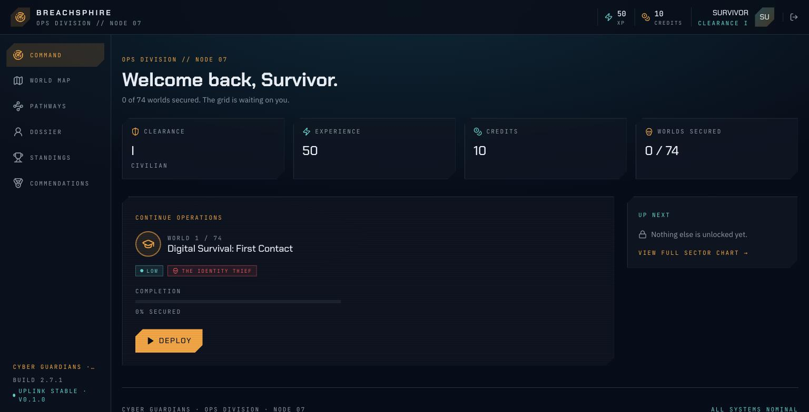
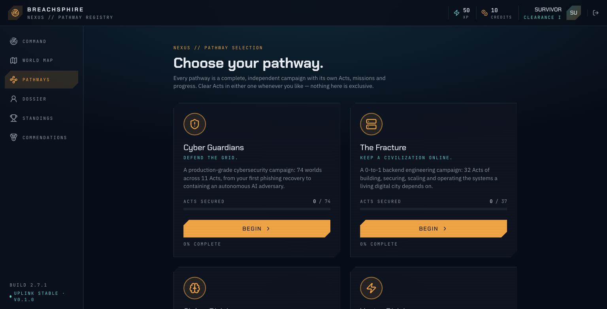
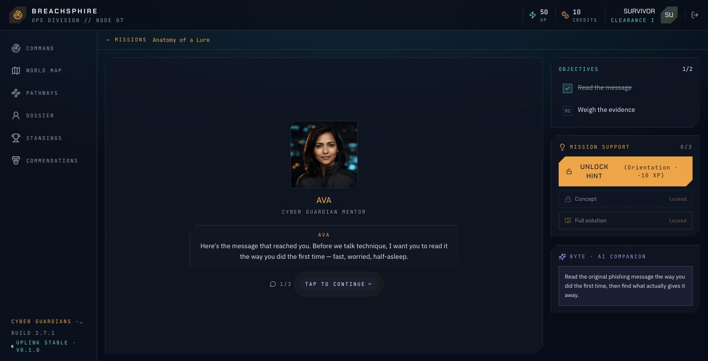
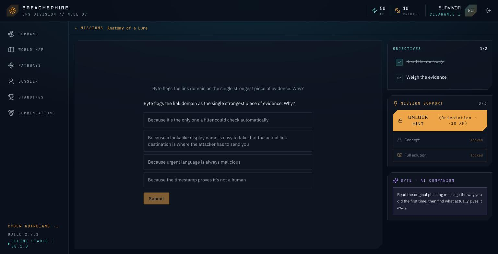
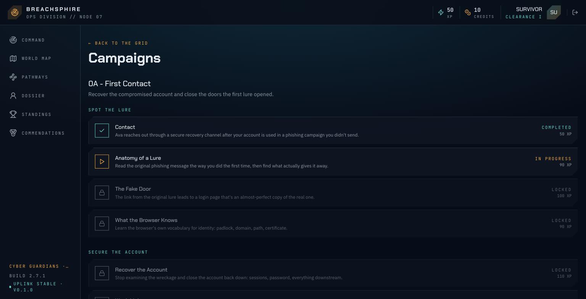
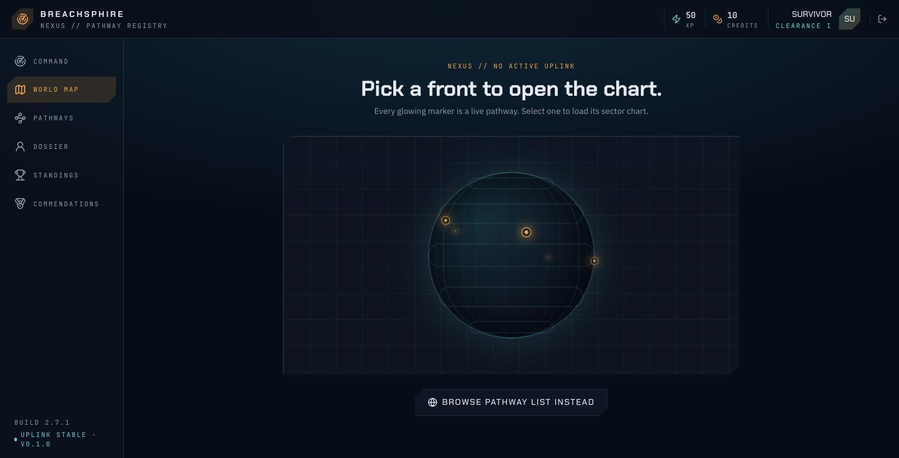

# Breachsphire

A story-driven learning game for engineers. Players join Nexus, a futuristic
operations organization, get sent on missions, investigate incidents, and earn
clearance, XP and credits instead of watching lectures and taking quizzes.

Five independent pathways, each a full campaign with its own Acts and missions:

| Pathway | Track | Scope |
| --- | --- | --- |
| **Cyber Guardians** | Cybersecurity | 74 worlds across 11 Acts, from a first phishing recovery to containing an autonomous AI adversary |
| **The Fracture** | Backend engineering | Building, securing, scaling and operating the systems a digital city depends on |
| **Cipher Division** | AI / ML | From a first model to production AI: classical ML, deep learning, NLP, transformers, LLMs, RAG and agents |
| **Vector Division** | Robotics, embedded & IoT | Electronics, firmware, RTOS, sensors, control, ROS 2, SLAM and safety-critical design |
| **Atlas Division** | Cloud, DevOps & SRE | From one Linux host to multi-region infrastructure: Docker, Terraform, Kubernetes, observability, incident response, DR |

Full design and architecture reference: **[docs/](./docs/README.md)**.

**Play it:** [breachsphire.yourwaytolearn.com](https://breachsphire.yourwaytolearn.com)

| Command center | Pathway selection |
| --- | --- |
|  |  |

| Mission briefing | Mission challenge |
| --- | --- |
|  |  |

| Campaign missions | World map |
| --- | --- |
|  |  |

## Quickstart

Needs a Supabase project for auth + the database. Two ways to get one:

- **Cloud (default, no Docker needed)** — create a free project at
  [supabase.com](https://supabase.com), run the SQL in
  `infra/supabase/migrations/` via its SQL Editor, then grab the Project URL /
  anon key / JWT Secret from Project Settings → API.
- **Local (needs Docker)** — `pnpm db:start` boots the same stack
  (Postgres + Auth + Studio) via the Supabase CLI and applies the migration
  automatically; `pnpm db:status` prints the same three values pointed at
  `127.0.0.1`. Stop it with `pnpm db:stop`.

Either way, copy `apps/web/.env.example` → `apps/web/.env` and
`apps/api/.env.example` → `apps/api/.env`, fill in the values, then:

```bash
pnpm install
pnpm dev
```

- `apps/web` — http://localhost:5173
- `apps/api` — http://localhost:3001 (`/health`)

Or run one side at a time: `pnpm dev:web` / `pnpm dev:api`.

### Desktop

```bash
pnpm dev:desktop      # local web + API + Electron shell
pnpm build:desktop    # unpacked app in apps/desktop/dist/win-unpacked
pnpm dist:desktop     # Windows installer in apps/desktop/dist
```

The packaged app uses the same Supabase account and deployed API as the web
application, so progress remains synchronized. See
[Forge Lab & desktop architecture](./docs/14-backend-forge-lab.md).

## Current implementation

The authenticated Cybersecurity and 32-Act Backend Engineering pathways are
implemented against Supabase/PostgreSQL. Forge Lab adds 12 system-design
briefs, five portfolio campaigns, and Java/Spring, Python/FastAPI, and Go
specializations with persisted progress. The Electron shell packages the same
experience for Windows.

## Testing

`apps/web` has a Playwright e2e suite that runs against the real dev servers
and the real Supabase project (no mocks) — auth (login/logout/session
persistence/protected routes), signup, and the World Map's live data.

It logs in as a **persistent test account** rather than creating a throwaway
user per run: copy `apps/web/.env.test.example` to `apps/web/.env.test` and
fill in that account's credentials (ask a teammate, or sign up your own test
account and use it — its World Map state is expected to stay untouched,
since nothing yet writes to `player_world_progress` after signup).

```bash
pnpm dev                      # dev servers must be running (or let Playwright start them)
cd apps/web
pnpm test:e2e                 # headless
pnpm test:e2e:ui              # interactive UI mode
```

## Status

The mission engine, pathway selection, progression data, Forge Lab, and
desktop shell are implemented. Remaining roadmap work includes real sandboxed
labs, richer achievements/leaderboards, content administration, publisher
signing, and a hosted desktop-download surface. See
[Development Phases & MVP Scope](./docs/09-development-phases.md).

## Repo layout

```
apps/       web (player frontend) · api (NestJS backend) · admin (Mission Builder, placeholder)
packages/   types (shared schema) · ui · game-engine · mission-engine · config · labs (placeholders)
infra/      infra/supabase (local Supabase project + migrations) · deployment config (placeholder)
docs/       design & architecture wiki
```

Details: [docs/08-repo-structure.md](./docs/08-repo-structure.md).
